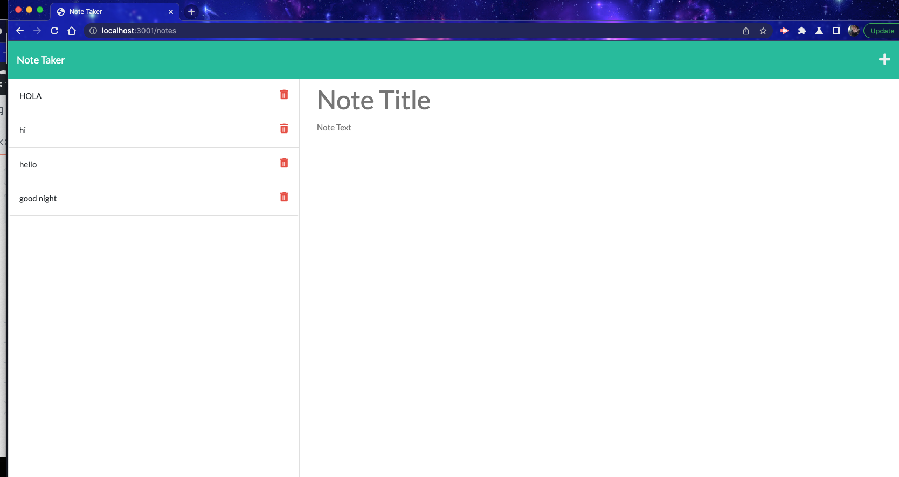

# noteTaker
This project was made for anyone that is a big note taker, but never has paper.
With this project you can make notes, read notes, and even fix notes.
This project can help you in everyday life! You can even just use it to make lists.
## How To
You just open the the server page and click getting started. This takes you to the notes page where you may type up as many notes as you want. Then if you need to edit your note, just click it and you can fix, or add anything you want and make it a new note.
## Install
First you must install the node pkgs
Next make sure you have installed the UUID this will make sure you can pull the notes back to edit.
Once these are done you may type node server.js in the command line to open the browser.
Once there your can just use the project like normal.

## Help
I went back through multiple lessons to make sure I fully understood what I needed to do.
I found that W3Schools was a good site for researching.

https://github.com/mfarrell23/noteTaker.git

